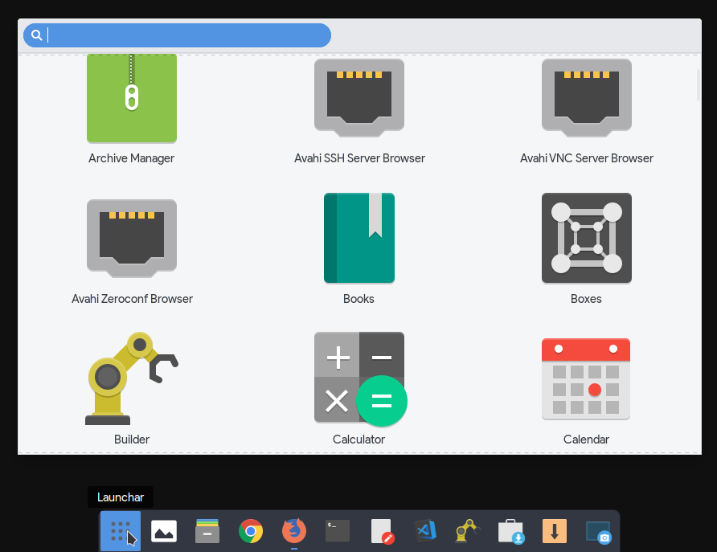

launchar
--------

Minimal GTK application launcher.

## Use cases

* Some Linux desktops limit application launcher to primary display. Pin to a multi-screen dock (or assign it a shortcut key) and it launches on current display.
* Alternative launcher for Tiling window managers.

## Build from source

```
$ meson --prefix=/usr build
$ cd build
$ sudo ninja install
```

### Build Dependencies

Arch

```
$ sudo pacman -S gtk3 vala meson ninja
```

Ubuntu

```
$ sudo apt install libgtk-3-dev valac meson ninja-build
```

Fedora

```
$ sudo dnf install gtk3-devel vala meson ninja-build
```

## Screenshot

[Gif Video](demonstration.gif)



## Donate

[Bitcoin](bitcoin:1GTHYEDiy2C7RzXn5nY4wVRaEN2GvLjwZN) | [PayPal](https://paypal.me/abiosoft)

