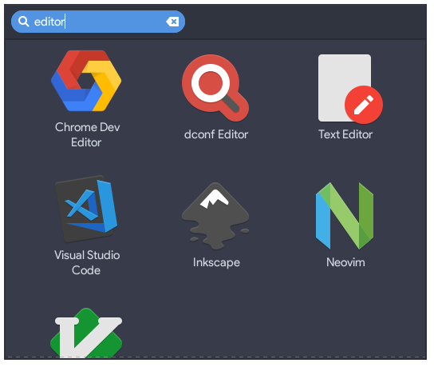

launchar
----------------

Minimal GTK application launcher.


## Build from source

```
$ meson --prefix=/usr
$ cd build
$ sudo ninja install
```

## Use case

Some Linux desktops limit application launchers to primary displays.
Pin to a multi-screen dock and it launches on current display.

## Screenshot


